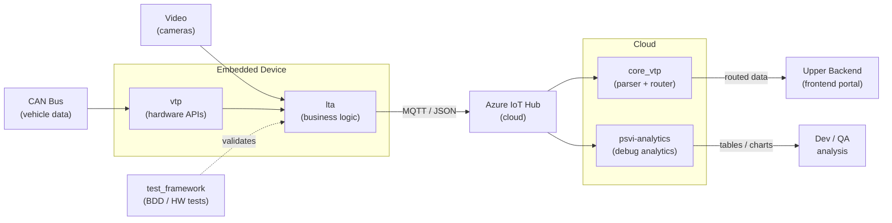

# Fleet Monitoring System — Workspace Overview

This repository groups all submodules that make up the end-to-end fleet monitoring pipeline: from an embedded device installed in a truck (CAN bus data + video recording) all the way through cloud processing and routing to a frontend portal used by fleet customers.

---

## System Overview

An embedded device installed in the vehicle collects telemetry data via the CAN bus and records video. The **vtp** platform provides low-level hardware APIs; **lta** runs on top of it, applying business logic to generate structured events and publish them to the cloud via MQTT. In the cloud, **core_vtp** parses and routes those messages to the upper backend layer consumed by the frontend portal, while **psvi-analytics** transforms the same raw data into human-readable tables and charts for debugging and pre-frontend analysis. **test_framework** validates the entire embedded stack on real hardware before any change reaches production.

---

## Architecture



---

## Submodules

| Submodule | Repo | Language / Stack | Purpose | Upstream dep | Downstream dep |
|---|---|---|---|---|---|
| **vtp** | `vehicle-telematics-platform` | C/C++, Make | Hardware-access platform: CAN bus, GPS, MQTT, sysmon | Hardware / HAL | lta, test_framework |
| **lta** | `ttm-telematics-linux-telematics-apps-na` | C++14, CMake, Docker | Business-logic apps that generate telemetry events and publish them via MQTT | vtp | test_framework, core_vtp |
| **test_framework** | `embedded_test_automation` | Python 3.10+, pytest-bdd | BDD test suite that validates lta behavior on real hardware | lta, vtp | — |
| **core_vtp** | `ttm-telematics-core-vtp` | Java, Maven | Cloud service that parses MQTT messages and routes data to the backend/portal | lta (message contracts) | Frontend portal |
| **psvi-analytics** | `psvi-analytics` | Python, matplotlib, folium | Transforms raw cloud messages into tables, charts, and maps for dev/QA analysis | lta (message contracts) | — |

---

## Submodule Details

### vtp — Vehicle Telematics Platform

- **`apps/vehicle-bus/`** — reads raw vehicle data from the CAN bus and publishes it as MQTT topics
- **`apps/sysmon/`** — monitors system health (CPU, memory, network) and reports device status
- **`apps/mqtt-bridge/`** — MQTT broker bridge; routes messages between device-local bus and cloud
- **`apps/location/`** — GPS acquisition and location publishing
- **`include/`** — public SDK headers consumed by lta and other dependents
- **`libs/`** — shared platform libraries (networking, storage, crypto, etc.)

### lta — Linux Telematics Apps

Most changes in this system originate in lta. It is the business-logic layer that turns raw vehicle data and video into actionable events sent to the cloud. Each app is an independent process that subscribes to MQTT topics, applies rules, and publishes results. All apps share the `libs/appcore/` framework for MQTT topic handling, config binding, SQLite access, and VTP function abstractions (`vtp_references`).

#### Apps (`lta/apps/`)

| App | Description | Unit tests |
|---|---|---|
| **`vehicle_data/`** | Processes CAN bus signals (speed, RPM, fuel, odometer, ignition) into structured telemetry messages | 12 tests: `can_bus`, `speed`, `rpm`, `fuel`, `odometer`, `ignition`, `bus_control`, `data_consolidation`, `forward_vehicle`, `vehicle_controls`, `vehicle_data`, `vehicle_info` |
| **`alarms/`** | Detects and publishes safety alarm events (collision warning/mitigation, headway, dynamic stability, seatbelt, haptic warning) | 7 tests: `alarms`, `collision_mitigation`, `collision_warning`, `dynamic_stability`, `haptic_warning`, `headway_warning`, `seatbelt` |
| **`lta_device_monitor/`** | Monitors device state: AI calibration, authentication, button presses, speed source, manifest, and parameter management | 7 tests: `ai_calibration_monitor`, `authentication_monitor`, `button`, `dev_mon`, `manifest`, `parameter`, `speed` |
| **`geolocation/`** | Geofence management and position reports; generates events on zone entry/exit | 3 tests: `geolocation`, `points`, `position_reports` |
| **`diagnostics/`** | Monitors device health (CPU usage, memory consumption) and publishes diagnostic reports | 3 tests: `cpu_monitor`, `diagnostics`, `memory_monitor` |
| **`safety/`** | Driver safety scoring and speed limit enforcement | 2 tests: `safety`, `speed_limit` |
| **`data_logger/`** | Persists telemetry data to SQLite for offline storage and later upload | 2 tests: `data_logger`, `log_data_dao` |
| **`device/`** | Device provisioning and identity management (V3G provisioning) | 2 tests: `device_main`, `v3g_provisioning` |
| **`vehicle_data_dispatcher/`** | Routes processed vehicle data to the appropriate cloud MQTT topics | 1 test: `vehicle_data_dispatcher` |
| **`driver_assist/`** | Manages camera feeds (right, left, rear) for driver assistance overlays and split-screen display | 1 test: `driver_assist` |
| **`video_events/`** | Detects events that trigger video clip recording and upload | 1 test: `video_events` |
| **`notifier/`** | Plays audio alerts (MP3) and buzzer notifications in response to events | 1 test: `notifier` |
| **`log_sender/`** | Sends device log files via email on remote request | 1 test: `log_sender` |
| **`lta_location/`** | Wraps VTP location data for lta consumption | 1 test: `location` |
| **`lta_remotepublisher/`** | Publishes data to remote endpoints on demand | 1 test: `remote_publisher` |
| **`lta_video_monitor/`** | Monitors video channel health and camera status | 1 test: `video_monitor` |
| **`lta_wifi/`** | Manages Wi-Fi connectivity and configuration | 1 test: `wifi` |
| **`shutdown/`** | Handles graceful device shutdown sequence | 1 test: `shutdown` |
| **`vehicle_status/`** | Operational analysis: idle engine detection, RPM excess, RPM telemetry | no unit tests |
| **`streamax_info/`** | Reads Streamax hardware info (SIM ICCID/IMEI, firmware versions) | no unit tests |

#### Libraries and configs

- **`libs/appcore/`** — core framework: MQTT topic classes (~80+), config binding, SQLite, VTP function abstractions (`vtp_references`) for dependency injection in tests
- **`configs/`** — per-device and per-environment configuration files

### test_framework — Embedded Test Automation

- **`tests/`** — BDD `.feature` files and pytest step definitions organized by test area
- **`src/`** — framework core (device control, CAN injection, MQTT capture, serial logging)
- **`bin/`** — utility scripts: `relay_control`, `run_psu`, `retrieve_data`, `software_update`
- **`pyproject.toml`** — dependencies: `python-can`, `paho-mqtt`, `pytest-bdd`, `cantools`, `opencv-python`

### core_vtp — Cloud Message Parser & Router

- **`src/`** — Java source: message parsers, topic handlers, routing logic
- **`catalog/`** — message type catalog / schema definitions
- **`docs/`** — integration documentation
- Built with Maven; deployed as a cloud service consuming Azure IoT Hub messages

### psvi-analytics — Cloud Debug Analytics

- **`src/analyzers/`** — modular analyzers per message type (video events, movement, speed signs, etc.)
- **`src/azure/`** — Azure IoT Hub API client and OAuth2 authentication
- **`tools/`** — standalone utilities: `delete_device.py`, `log_request.py`, `update_device_twin.py`
- **`config/`** — device list and API credentials (not tracked in git)
- Connects to Azure IoT Hub, pulls raw messages, and renders results via matplotlib / folium

---

## Change Impact Matrix

When you modify a submodule, the following others **must** be reviewed and updated:

| Changed submodule | Must also update |
|---|---|
| **vtp** (new API or topic) | lta (consumes the API), test_framework (may need new stubs) |
| **lta** (new message, field change, or new app) | test_framework (test coverage), core_vtp (parser + routing), psvi-analytics (analyzer if new message type) |
| **test_framework** | — (leaf; no dependents) |
| **core_vtp** (routing or schema change) | — (leaf; no dependents) |
| **psvi-analytics** | — (leaf; no dependents) |

---

## Repository Setup

This repo uses Git submodules. Clone everything in one step:

```bash
git clone --recurse-submodules git@github.com:PeopleNet/<this-repo>.git
```

Or initialize after a plain clone:

```bash
git submodule update --init --recursive
```

Each submodule has its own README with build and setup instructions. Start with **`lta/README.md`** for the embedded build environment and **`test_framework/README.md`** for the hardware test setup.